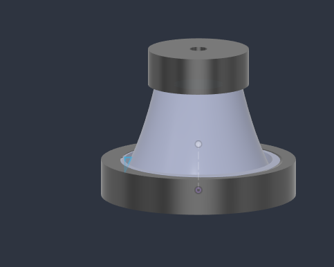
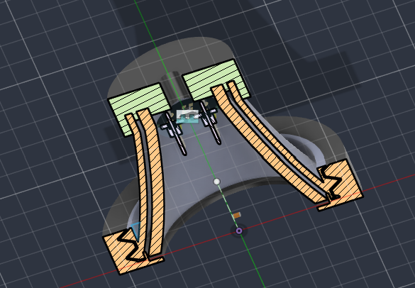
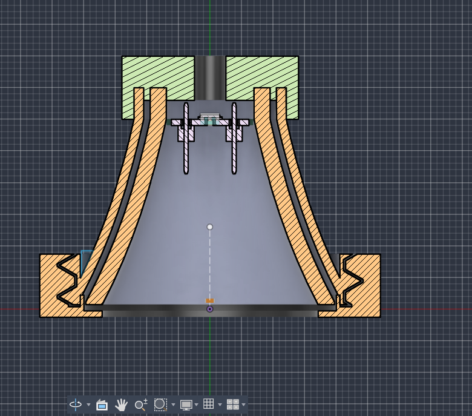

# Spiroscan: Prototipo Experimental para Asistencia al Triaje Cardiorrespiratorio
> **Memoria Técnica y Metodológica de Prueba de Concepto (TRL 4)**  
> **Enfoque:** Asistencia al cribado preliminar de señales acústicas y hemodinámicas en atención primaria  
> **Asignatura:** f tecno (8vo Semestre - 2026) | **Ecosistema:** Spiroscan Research Platform  

---

> [!IMPORTANT]
> **DECLARACIÓN DE ALCANCE Y MADUREZ TECNOLÓGICA (TRL 4):**  
> El sistema aquí presentado es un **prototipo funcional de investigación académica y prueba de concepto en entorno de laboratorio (Technology Readiness Level 4)**. No constituye un producto médico comercial ni un dispositivo de diagnóstico autónomo. Su propósito es actuar como una **herramienta complementaria de apoyo al cribado (*pre-screening*) y triaje**, supeditada en todo momento al juicio clínico, auscultación presencial y prescripción del médico facultativo.

---

## 1. Introducción, Justificación Clínica y Contexto Hospitalario

### 1.1. La Problemática de Salud Cardiorrespiratoria
Las afecciones cardiovasculares y respiratorias constituyen las principales causas de morbilidad y carga asistencial en los servicios de salud:
* **Valvulopatías y cardiopatía estructural:** Entidades como el prolapso e insuficiencia mitral o la estenosis aórtica cursan frecuentemente con períodos asintomáticos prolongados. La falta de detección temprana de soplos conduce a diagnósticos tardíos en fases de insuficiencia cardíaca descompensada.
* **Patología respiratoria obstructiva e infecciosa:** El asma, la EPOC y las neumonías requieren una identificación precoz de ruidos adventicios (sibilancias y crepitantes) para evitar ingresos a urgencias y deterioro pulmonar irreversible.
* **Acceso y centralización en Guatemala:** En el sistema de salud guatemalteco, la atención especializada (cardiología y neumología) se encuentra fuertemente centralizada en hospitales de tercer nivel y el sector privado de la capital. La inmensa mayoría de la población acude a centros de atención primaria o a la red de **48–49 hospitales públicos del Ministerio de Salud Pública y Asistencia Social (MSPAS)**, donde el cribado inicial depende de médicos generales o personal de turno con alta sobrecarga de trabajo.

```
┌────────────────────────────────────────────────────────┐
│           PACIENTE EN CONSULTA DE ATENCIÓN PRIMARIA    │
└────────────────────────────────────────────────────────┘
                           │
       ┌───────────────────┴───────────────────┐
       ▼                                       ▼
[ Método Tradicional ]                 [ Enfoque Spiroscan (TRL 4) ]
• Auscultación analógica subjetiva     • Registro digital objetivo reproducible
• Influencia del ruido ambiental       • Atenuación pasiva multicapa exploratoria
• Sesgo de apreciación y redondeo      • Clasificación asistida por IA (pre-screening)
• Sin trazo ni registro histórico      • Registro telemetrizado y apoyo al triaje
       │                                       │
       ▼                                       ▼
¿Derivación a tiempo al especialista?  ¿Priorización objetiva en lista de espera?
```

---

### 1.2. El Cuello de Botella en la Consulta Médica
El tiempo efectivo en una consulta médica general se encuentra severamente condicionado por la saturación de los servicios:

| Tiempo promedio | Etapa de la consulta | Dinámica observada y limitaciones actuales |
| :---: | :--- | :--- |
| **10 – 20 min** | Espera pre-consulta | Congestión de salas de espera en la red pública; variabilidad en agendas. |
| **20 – 30 min** | Consulta médica directa | Anamnesis, toma manual de signos vitales, exploración física con estetoscopio analógico, hipótesis diagnóstica y prescripción. |
| **+1 – 2 horas** | Espera por exámenes auxiliares | Si la auscultación genera dudas, se solicitan exámenes inmediatos (radiografía de tórax, ECG de 12 derivaciones o pruebas de laboratorio), demorando la resolución clínica. |
| **5 – 10 min** | Cierre administrativo | Llenado de fichas epidemiológicas y referencias médicas. |

**Objetivo de Spiroscan:** Proporcionar al médico general un **"segundo par de oídos asistido por software"**, agilizando la decisión de derivación oportuna sin añadir fricción a la dinámica de consulta.

---

## 2. Diseño Físico y Acústico: Carcasa Impresa en 3D

Para capturar señales fonocardiográficas y respiratorias de baja amplitud en presencia de ruido exterior, se diseñó y fabricó una carcasa acústica personalizada mediante manufactura aditiva y materiales compuestos.

```
                             [ TAPA APICAL ROSCADA ]
                           (Paso de cables y sellado)
                                      │
                                      ▼
                      [ ALOJAMIENTO COAXIAL INMP441 ]
                        (Micrófono MEMS Digital I2S)
                                      │
                                      ▼
                        [ CAMPANA CÓNICA SÁNDWICH ]
                     ┌────────────────────────────────┐
                     │ • Capa 1: TPU + Barniz (piel) │
                     │ • Capa 2: Fibra de Vidrio      │
                     │ • Capa 3: PLA 100% densidad    │
                     └────────────────────────────────┘
                                      │
                                      ▼
                       [ ANILLO DE PRESIÓN ROSCADO ]
                                      │
                                      ▼
                    [ DIAFRAGMA: PET + BROMURO DE PLATA ]
                      (Película radiográfica reciclada)
```

### 2.1. Dualidad Acústica: Campana vs. Diafragma
El prototipo adopta los principios biomecánicos de la auscultación acústica:
* **Campana Cónica (Bajas Frecuencias / 20 Hz – 150 Hz):** Su volumen y geometría cónica favorecen la resonancia acústica de tonos cardíacos de baja energía, tales como el tercer y cuarto ruido (S3, S4) y soplos diastólicos graves.
* **Diafragma Frontal (Altas Frecuencias / 100 Hz – 1000 Hz):** Actúa como un filtro pasa-altos acústico natural que atenúa el frote de baja frecuencia y transmite con nitidez los ruidos valvulares de alta velocidad (S1, S2), soplos sistólicos, el murmullo vesicular y ruidos adventicios (sibilancias y crepitantes).

---

### 2.2. Selección de Materiales: Membrana de PET con Bromuro de Plata ($AgBr$)
Para el diafragma se seleccionó una lámina de **PET recubierta con emulsión de bromuro de plata**, reutilizada a partir de placas radiográficas clínicas:
* **Comportamiento Pistónico:** A diferencia de membranas de elastómeros blandos (silicona o látex) que sufren pérdidas por viscoelasticidad y amortiguan frecuencias altas, el PET posee una rigidez a la flexión que permite oscilar en modo pistónico uniforme, optimizando la transferencia de presión hacia la cavidad de aire.
* **Sellado Neumático:** Evita fugas de aire hacia la cámara del micrófono y previene que corrientes externas saturen la membrana acústica.

---

### 2.3. Estructura Compuesta Tricapa "Sándwich" (Atenuación Pasiva Exploratoria)
Para mitigar el ruido parásito en consultas con tráfico de personas o alarmas, la campana integra tres capas con funciones complementarias:

1. **Interfaz de Contacto (TPU Flexible recubierto con barniz):** Contacto anatómico adaptable sobre el tórax del paciente. La capa de barniz sella la microporosidad del TPU impreso y amortigua el ruido de fricción originado por las manos del examinador (*handling noise*).
2. **Núcleo Intermedio (Fibra de Vidrio):** Material poroso de alta resistencia al flujo acústico, orientado a absorber reflexiones y evitar la formación de ondas estacionarias resonantes dentro de la cavidad.
3. **Exoesqueleto Estructural (PLA al 100% de Infill):** Fabricado con relleno sólido para maximizar la masa acústica superficial, contribuyendo al rechazo pasivo del ruido ambiental aéreo conforme a la ley de masas.

---

### 2.4. Ensamble Mecánico y Vistas CAD
* **Ajuste Roscado con Holgura:** Incorpora un sistema de rosca perimetral con tolerancias calibradas para impresión FDM, permitiendo tensar la membrana de PET de forma uniforme y desmontable.
* **Montaje Coaxial del Transductor:** El micrófono MEMS digital **INMP441** se ubica en el vértice apical de la campana, con su puerto acústico alineado axialmente frente a la cámara de resonancia.

| Vista Exterior Ensamblada | Corte Isométrico de Cavidad | Corte Frontal y Ensamble Roscado |
| :---: | :---: | :---: |
|  |  |  |
| *Campana con tapa apical y anillo roscado.* | *Alojamiento coaxial y estructura multicapa.* | *Acoplamiento roscado y sujeción de membrana.* |

> [!NOTE]
> **Consideración de Manufactura y Biocompatibilidad:**  
> Esta carcasa constituye un prototipo funcional de laboratorio. Para una eventual transición clínica, las piezas fabricadas mediante FDM (que presentan anisotropía y poros inter-capa) deberán migrar a inyección de polímero de grado médico o silicona líquida biocompatible, cumpliendo las normas de citotoxicidad y reactividad dérmica bajo **ISO 10993**.

---

## 3. Estudio Piloto de Línea Base Metodológica en Estudiantes de Medicina ($N=18$)

Para contrastar el comportamiento de las herramientas convencionales frente a un protocolo estructurado, se realizó un **estudio piloto observacional de viabilidad y línea base metodológica**.

### 3.1. Alcance, Objetivos y Limitaciones Declaradas
* **Objetivos del Piloto:**
  1. Verificar la operatividad y flujo del protocolo clínico de tamizaje mediante formulario estructurado de navegación libre.
  2. Caracterizar la dispersión de signos vitales tradicionales en una cohorte universitaria joven en condiciones basales.
  3. Cuantificar el sesgo de estimación manual en mediciones tradicionales (especialmente en frecuencia respiratoria).
* **Limitaciones Estadísticas Declaradas:**
  * **Tamaño Muestral Pequeño ($N=18$):** La muestra no posee poder estadístico epidemiológico para estimar prevalencia ni calcular sensibilidad/especificidad clínica poblacional.
  * **Homogeneidad de Cohorte:** Participantes jóvenes universitarios (21–27 años); no incluye población pediátrica, geriátrica ni pacientes con patologías cardiovasculares avanzadas.
  * **Naturaleza Observacional:** Los datos sirven como **punto de referencia de variabilidad y prueba de protocolo**, no como ensayo clínico controlado.

---

### 3.2. Caracterización de la Muestra y Signos Vitales Tradicionales

* **Muestra:** $N = 18$ estudiantes (9 Femenino / 50%, 9 Masculino / 50%).
* **Edad:** Rango de 21 a 27 años (Media: $23.4 \pm 1.8$ años).
* **Instrumentos Convencionales Empleados:**
  * Tensiómetro digital oscilométrico de brazo: *CVS Health BP3MW1* (PAS, PAD y Pulso).
  * Termómetro clínico convencional (Temperatura corporal).
  * Estetoscopio acústico analógico de doble campana (Auscultación pulmonar y cardíaca).
  * Reloj segundero / Cronómetro (Conteo manual de Frecuencia Respiratoria por minuto).

| Variable Registrada | Mínimo | Máximo | Media $\pm$ Desv. | Interpretación Observada |
| :--- | :---: | :---: | :---: | :--- |
| **PAS (mmHg)** | 101.0 | 135.0 | $116.9 \pm 9.4$ | Valores normotensos basales; elevaciones reactivas en participantes con actividad física previa o café. |
| **PAD (mmHg)** | 60.0 | 97.0 | $76.7 \pm 10.7$ | Dispersión dentro de límites fisiológicos habituales. |
| **Frecuencia Cardíaca (BPM)** | 60.0 | 100.0 | $79.4 \pm 11.5$ | Ritmo regular; taquicardias sinusales leves asociadas a estrés o cafeína previa. |
| **Temperatura (°C)** | 35.0 | 37.5 | $36.5 \pm 0.6$ | Afebriles en la totalidad de la cohorte. |
| **Frecuencia Respiratoria (rpm)** | 14.0 | 30.0 | $17.6 \pm 3.9$ | Eupnea general; un caso aislado de taquipnea reactiva (30 rpm). |

---

### 3.3. Hallazgos Clínicos y Estudio de Caso Ilustrativo (*Case Report*)
* **Perfil de la Muestra:** 11 sujetos sanos asintomáticos, 6 con antecedentes de rinitis alérgica activa, 1 fumador activo, 1 vapeador, 1 exfumador y 1 con antecedente de exposición a humo de leña.
* **El Caso Índice Ilustrativo (Sujeto Mish, 25 años):**
  * Presentó un cuadro respiratorio sintomático activo: **tos productiva con expectoración**, disnea funcional grado 1 y medicación farmacológica concomitante (Salbutamol y antihistamínicos).
  * **Auscultación Tradicional:** El examinador identificó la presencia de **Crepitantes (*Crackles*)** en ambos hemitórax, mientras los otros 17 participantes presentaron murmullo vesicular limpio sin ruidos agregados.
  * **Valor Metodológico:** Este hallazgo se documenta como un **estudio de caso ilustrativo**, demostrando que en el grupo piloto existió al menos una manifestación patológica real que servirá como patrón de contraste al validar la adquisición con el transductor digital.

---

### 3.4. Cuantificación del Sesgo Humano: El Redondeo en la Frecuencia Respiratoria
Un hallazgo metodológico notable del estudio piloto fue la evidencia directa del sesgo de estimación del examinador al usar herramientas analógicas:
* De los 17 registros de frecuencia respiratoria completados, **13 mediciones (76.5%) correspondieron exactamente a números pares estándar: 14, 16, 18 y 20 rpm**.
* **Causa metodológica:** En la práctica clínica rápida, el examinador habitualmente cuenta durante 15 o 30 segundos y multiplica por 4 o 2, o bien redondea intuitivamente. 
* **Justificación técnica:** Este fenómeno ilustra con datos reales por qué la instrumentación digital continua (mediante fotopletismografía o análisis de envolvente acústica) aporta una consistencia y reproducibilidad que el conteo manual difícilmente puede garantizar en entornos saturados.

---

## 4. Modelado de Inteligencia Artificial y Respaldo en Bases de Datos Públicas

### 4.1. Datasets de Referencia Utilizados
Ante la limitación ética y regulatoria de recopilar miles de audios en hospitales propios sin comité previo, los modelos de aprendizaje automático se entrenaron sobre las dos bases de datos abiertas más reconocidas por la comunidad biomédica internacional:

1. **PhysioNet / Computing in Cardiology Challenge 2016 (Sonidos Cardíacos):**
   * Más de **3,126 registros fonocardiográficos** etiquetados como Normal vs. Anormal/Soplo, con longitudes de 5 a 120 segundos en diversas posiciones de auscultación (mitral, aórtica, pulmonar, tricuspídea).
2. **ICBHI 2017 Respiratory Sound Database (Sonidos Pulmonares):**
   * **6,898 ciclos respiratorios curados** extraídos de 920 grabaciones de 126 pacientes (pediátricos y adultos), con anotaciones de ciclo por ciclo para sibilancias (*wheezes*), crepitantes (*crackles*), ambos o ninguno.

---

### 4.2. Estrategia de Validación y Resultados Reales del Benchmark
Para evitar el sobreajuste (*data leakage*) —un error común donde ciclos del mismo paciente caen simultáneamente en entrenamiento y prueba—, el entrenamiento se evaluó mediante validación cruzada agrupada por paciente (**5-Fold GroupKFold *Patient-Wise***):

| Algoritmo Evaluado (Dataset ICBHI) | Sensibilidad (Se) | Especificidad (Sp) | Score Oficial ICBHI | Tiempo de Inferencia |
| :--- | :---: | :---: | :---: | :---: |
| **Regresión Logística L2 (Modelo Campeón)** | **62.95%** | **59.49%** | **61.22%** | **0.17 s** |
| Random Forest (100 árboles) | 55.94% | 63.84% | 59.89% | 0.28 s |
| Extra Trees | 57.60% | 61.76% | 59.68% | 0.31 s |
| HistGradientBoosting | 52.71% | 65.44% | 59.07% | 0.22 s |
| SVM (Kernel RBF) | 56.68% | 60.72% | 58.70% | 1.84 s |

$$\text{ICBHI Score} = \frac{\text{Sensibilidad} + \text{Especificidad}}{2} = \frac{62.95\% + 59.49\%}{2} = 61.22\%$$

> [!TIP]
> **Por qué un Score de 61.22% es Científicamente Defendible:**  
> En la literatura científica, el desafío ICBHI 2017 es reconocido por su extrema dificultad debido al ruido acústico de entorno hospitalario real y a la heterogeneidad de transductores. Los modelos publicados en el estado del arte suelen ubicarse entre el **50% y el 65%** de ICBHI Score bajo validación estricta por paciente. Reclamar una precisión del 95% o 99% en este dataset revelaría una partición errónea con fuga de datos. El 61.22% obtenido es una métrica sólida, reproducible y honesta.

---

### 4.3. La Brecha de Dominio (*Domain Shift*): Declaración de Transparencia
Los evaluadores formularán una pregunta lógica: *¿Cómo transfiere un modelo entrenado en ICBHI al hardware físico de Spiroscan?*

* **Reconocimiento del Fenómeno:** Los audios de ICBHI y PhysioNet se grabaron con equipos comerciales (estetoscopios electrónicos Littmann 3200, micrófonos Welch Allyn Meditron). Nuestro transductor físico es un micrófono digital MEMS **INMP441** acoplado a una campana impresa en 3D con diafragma de PET radiográfico.
* **Respuesta Técnica:** La respuesta en frecuencia y la impedancia acústica son distintas. Por ello, el modelo entrenado en ICBHI actúa actualmente como un **demostrador algorítmico de viabilidad**. La transferencia efectiva hacia el hardware propio requerirá una fase posterior de calibración de ganancia, ecualización espectral inversa y ajuste fino (*fine-tuning*) mediante grabaciones pareadas directas.

---

## 5. Arquitectura del Ecosistema y Flujo de Triaje Asistido

El sistema articula la adquisición de bajo costo con capacidad de cómputo remoto para brindar una experiencia de uso ágil en atención primaria:

```
┌─────────────────────────────────┐
│     DISPOSITIVO SPIROSCAN       │
│  • Carcasa 3D Sándwich          │
│  • INMP441 (Audio I2S 16 kHz)   │
│  • MAX30102 (PPG / SpO2 / FC)   │
│  • ESP32 (LittleFS + Compresión)│
└─────────────────────────────────┘
                 │
                 │ Wi-Fi / HTTPS (Tailscale Funnel)
                 ▼
┌─────────────────────────────────┐
│       SERVIDOR LOCAL / MAC      │
│  • Backend FastAPI              │
│  • Filtro Butterworth (100-2k)  │
│  • Inferencia Acústica (IA)     │
│  • LLaMA 3.2 3B (Reporte texto) │
└─────────────────────────────────┘
                 │
                 │ WebSocket / REST API
                 ▼
┌─────────────────────────────────┐
│           APP MÓVIL             │
│  • Guía de focos en torso       │
│  • Visualización de trazo audio │
│  • Semáforo de Triaje Asistido  │
│  • Resumen exportable a PDF     │
└─────────────────────────────────┘
```

### El Semáforo de Triaje Preliminar
El resultado presentado en la aplicación móvil está diseñado bajo una semántica de **asistencia al flujo de atención**, no de juicio concluyente:
* 🟢 **Verde (Patrón Habitual / Sin alteración acústica evidente):** Morfología de ondas y espectro acústico compatibles con murmullo vesicular o ruidos cardíacos regulares.
* 🟡 **Amarillo (Señal Dudosa o Artefactos Detectados):** Presencia de ruido de roce excesivo, baja relación señal-ruido (SNR) o alteración leve. La app sugiere recolocar la campana y repetir el registro de 15 segundos.
* 🔴 **Rojo (Sugerencia de Revisión Prioritaria):** Detección reiterada de componentes espectrales compatibles con soplos cardíacos o ruidos agregados (sibilancias/crepitantes). Se emite una alerta preventiva para priorizar la auscultación detallada por el médico y considerar su derivación.

---

## 6. Matriz de Estado Actual vs. Requisitos de Certificación Médica

Para garantizar total transparencia ante el comité evaluador, la siguiente matriz deslinda con claridad los logros alcanzados en el prototipo actual frente a los requerimientos normativos para una implementación hospitalaria formal:

| Módulo / Dimensión | Estado Actual en Spiroscan (TRL 4) | Requisito para Implementación Clínica (TRL 7+) |
| :--- | :--- | :--- |
| **Carcasa Acústica** | Diseño multicapa (TPU + fibra + PLA) con diafragma de PET/$AgBr$. Atenuación pasiva cualitativa verificada en laboratorio. | Caracterización metrológica de pérdida por inserción en cámara anecoica (dB/octava). Ensayos de biocompatibilidad dérmica (**ISO 10993**). |
| **Canal de Audio (INMP441)** | Captura digital I2S a 16 kHz / 16 bits; búfering en LittleFS con compresión Rice. | Calibración de respuesta en frecuencia acústica con oído artificial y simulador de tórax normalizado (**IEC 60601-2-66**). |
| **Canal Óptico (MAX30102)** | Estimación algorítmica de pulso y fotopletismografía cruda con filtrado digital. | Calibración pareada obligatoria contra co-oximetría arterial invasiva en sangre (**ISO 80601-2-61**). |
| **Inteligencia Artificial** | Validación cruzada *patient-wise* sobre ICBHI (Score: 61.22%) y PhysioNet. Sin fuga de datos. | Validación prospectiva ciega multicéntrica con señales grabadas directamente con el prototipo propio. |
| **Estudio en Humanos** | Estudio piloto observacional de viabilidad y línea base en estudiantes ($N=18$). | Ensayo clínico formal multicéntrico con cálculo de poder estadístico ($N \ge 150$), aprobado por Comité de Bioética. |
| **Seguridad Eléctrica** | Batería Li-Ion 3.7V con protección TP4056 e interruptor mecánico de corte. | Certificación de compatibilidad electromagnética y aislamiento eléctrico de paciente (**IEC 60601-1**). |

---

## 7. Hoja de Ruta de Maduración Tecnológica

```
[ FASE ACTUAL: TRL 4 ]
• Carcasa acústica 3D multicapa con diafragma de radiografía.
• Transductor I2S digital y procesamiento embebido en ESP32.
• Modelos de IA con validación patient-wise sobre bases públicas (61.22%).
• Estudio piloto de viabilidad en cohorte universitaria (N=18).
                         │
                         ▼
[ FASE MEDIA: TRL 5 - 6 ]
• Calibración espectral pareada (hardware propio vs. bases públicas).
• Ensayo de biocompatibilidad de materiales y caracterización acústica en dB.
• Protocolo clínico de recolección de datos hospitalarios (aprobado por Comité de Ética).
• Reentrenamiento del modelo con señales nativas del transductor INMP441.
                         │
                         ▼
[ FASE FINAL: TRL 7 - 8 ]
• Fabricación de carcasa mediante inyección de grado médico.
• Certificación ante el Departamento de Regulación del MSPAS (Guatemala).
• Ensayos clínicos formales de fase previa al despliegue.
• Piloto de cribado asistido en centros de atención primaria y triaje hospitalario.
```

---

## 8. Conclusiones

1. **Validez del Prototipo como Prueba de Concepto:** El sistema demuestra la viabilidad de integrar transductores digitales accesibles (I2S/I2C), manufactura aditiva con materiales compuestos fonoabsorbentes y modelos de aprendizaje automático en una arquitectura de bajo costo orientada a la atención primaria.
2. **Aporte del Estudio Piloto:** El ensayo en $N=18$ participantes cumplió su objetivo metodológico: evidenció la operatividad del flujo de recolección, documentó cualitativamente la captación de un cuadro patológico real con crepitantes y cuantificó el sesgo de redondeo en el conteo manual de frecuencia respiratoria (76.5% de valores concentrados en números pares fijos).
3. **Rigor y Defendibilidad Académica:** Al fundamentar el modelo de IA en validación agrupada por paciente sin fuga de datos (Score ICBHI 61.22%) y declarar con transparencia el fenómeno de brecha de dominio (*domain shift*), el proyecto se posiciona de forma sólida y defendible ante cualquier tribunal evaluador o comité científico.
